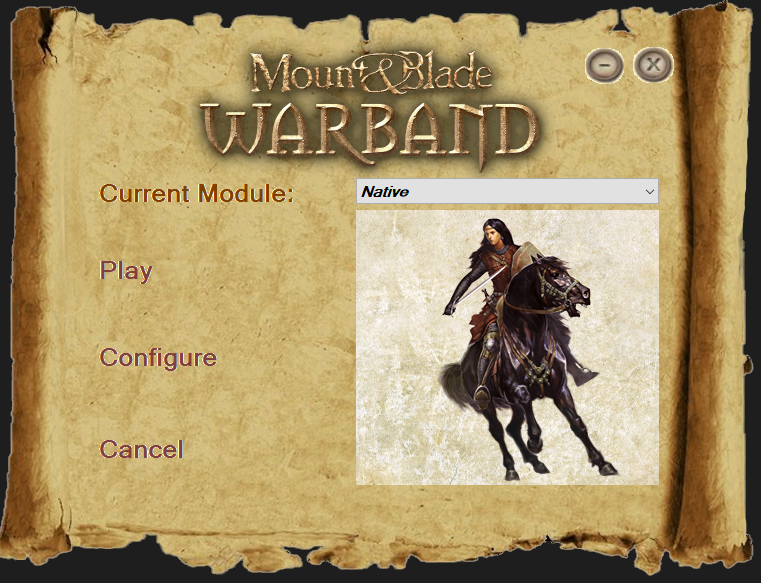
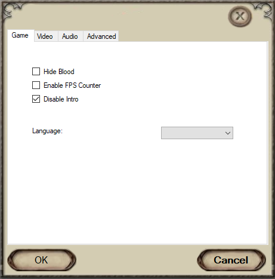

# Prototype GUI Launcher for Warband Script Enhancer 2

This is a prototype gui app intented to work with [WSE2](https://forums.taleworlds.com/index.php?threads/warband-script-enhancer-2-v1-0-6-3.384882/). The app in it's current state can interact with the config file at `~\Documents\Mount&Blade Warband WSE2\rgl_config.ini`, and edit program arguments using a gui. 

### TODO:
Make the controls (buttons, labels images) not disappear on alt tab.

The app is currently in testing mode, with a hardcoded WarbandPath string.

Add more ini settings that can be edited.

Add language options.

### rgl config editor
- Saves settings to the ini file at `C:\Users\<user>\Documents\Mount&Blade Warband WSE2\rgl_config.ini`, using Environment.SpecialFolder.UserProfile
- Allows editing of settings that require game restart
